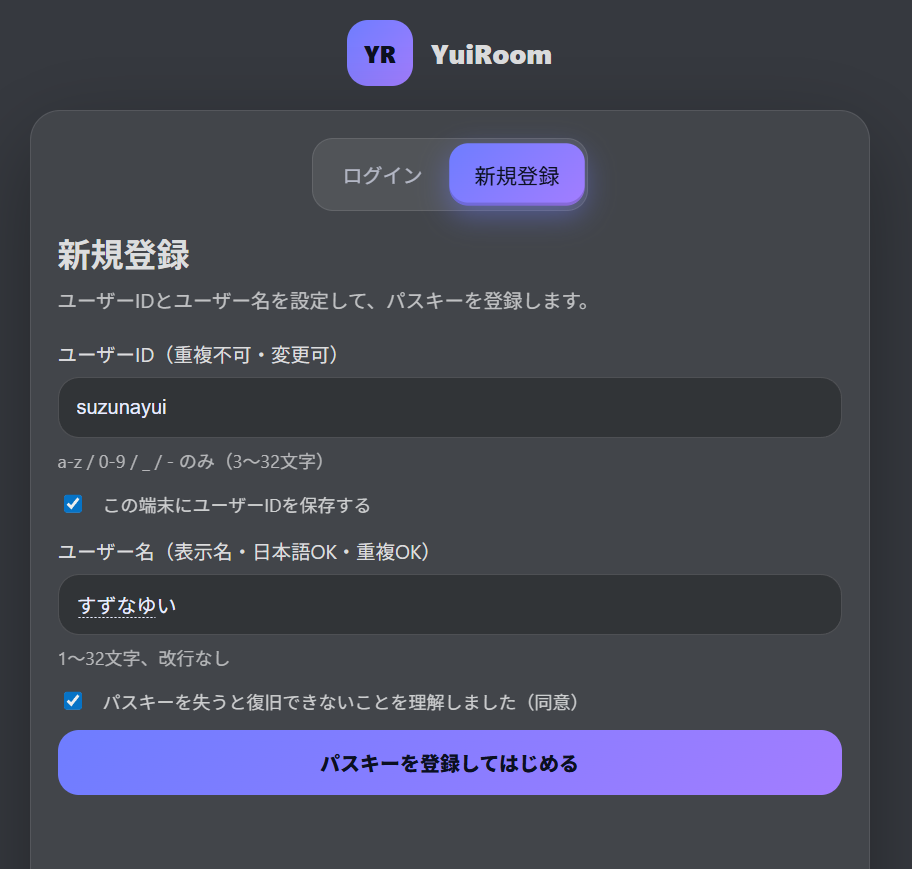
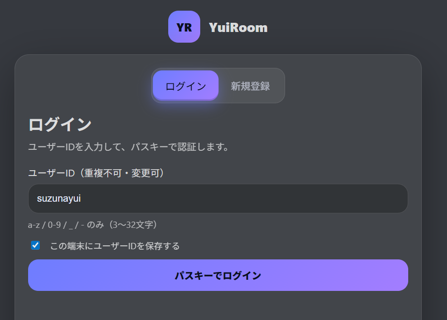

# YuiRoom

YuiRoomは、ユーザー同士でリアルタイムにメッセージをやり取りできるチャットアプリです。

実際のアプリ: https://yuiroom.net/

### 作業期間

このチャットアプリは2025年12月14日の1日で制作しました。詳細はコミット履歴をご確認ください。

## スクリーンショット

### 新規登録画面

### ログイン画面

### ログイン後のチャット画面

## 使用技術

- フロントエンド: React 19 と Vite を使用してUIを実装しています。
- デスクトップアプリ: Electron を使用し、デスクトップアプリとして起動できる構成にしています。
- バックエンド: Node.js + TypeScript + Express でAPIを実装しています。
- リアルタイム通信: `ws` を使用した WebSocket で、チャットの更新をリアルタイムに反映しています。
- データベース: PostgreSQL を使用しています。
- インフラ: Docker Compose で `backend`、`postgres`、`caddy`、`backup` をまとめて起動できる構成です。
- 認証まわり: 認証はパスキーのみを使用しており、パスワードやメールアドレスは使用していません。

## 主な機能

- パスキーのみで新規登録とログインができます。
- ルームとチャンネルを作成し、リアルタイムでチャットできます。
- ダイレクトメッセージで1対1のやり取りができます。
- 招待URLを発行し、ルームへ参加してもらうことができます。
- メッセージにリアクションを付けたり、スタンプを使ったりできます。
- フレンド機能、アンケート機能、監査ログ表示などの機能があります。

## 工夫した点

- WebSocket を使い、チャットや各種更新をリアルタイムに反映する構成にしています。
- 認証をパスキーのみにすることで、パスワード管理やメールアドレス入力なしで利用できるようにしています。
- フロントエンド、バックエンド、データベース、リバースプロキシを Docker Compose でまとめて起動できるようにしています。
- バックアップ用コンテナを分けて、データベースとシークレットを定期保存できるようにしています。

## デプロイ

デプロイ手順、バックアップ、リストアについては [DEPLOY.md](./DEPLOY.md) をご確認ください。
